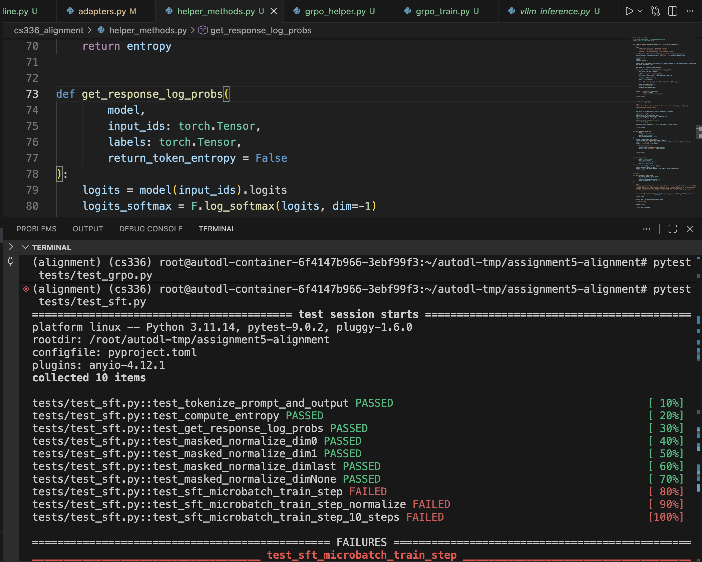
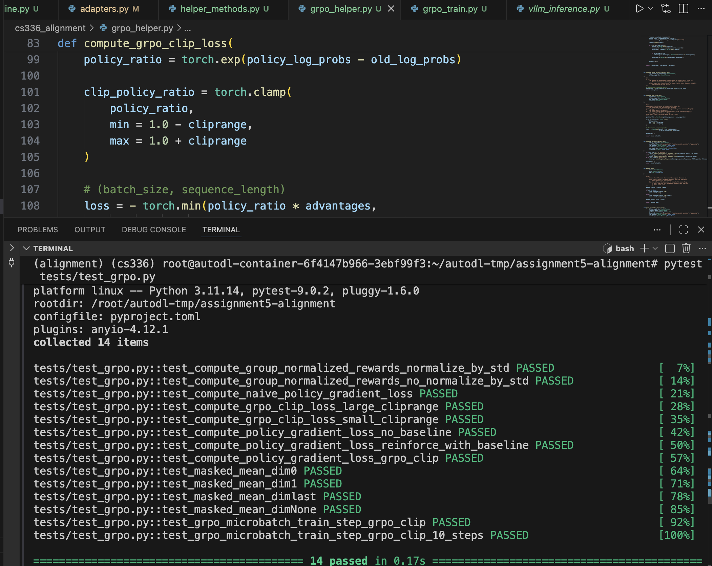

# Stanford CS336 Assignment5

函数实现在 RTX 4090 24G上完成 
GPU太小影响训练，可能调小sampling_max_tokens可以内存适应，但是token太小又会影响reward判断 
后续训练会选择在H800 100G上进行  
训练代码已经更新到grpo_train_v2.py 

## Data Source
数据集来自Kaggle MATH 
train = 7.5k, test = 5k  
没有sft数据 
可自行下载 

## Supervised Finetuning
sft_microbatch_train_step（）没有通过测试 
其他helper methods通过测试  

## Group Relative Policy Optimization
全部通过测试  

## grpo_train_v2.py
调整grpo_train_v1.py而来，增加了vllm evaluation  

